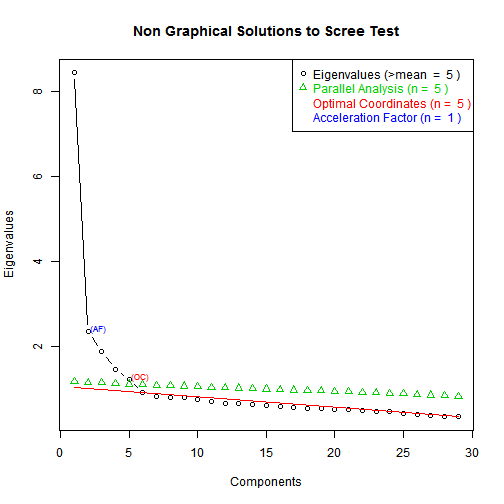

<div class="container">
<center>
<h2>TEMPLATE REPORT FOR DIMENSIONALITY REDUCTION</h2>

<h2>CASE: MARKET RESEARCH, MARKET SEGMENTATION, PURCHASE DRIVERS</h2>
</center>
<hr>

<!--Proccess Parameters:

Please first edit the parameters in the chunk below. These parameters incude the data used as well as parameters regarding how many factors/drivers to find and with which statistical methods. The data loaded in that file are used in this report.-->

```{r scree,echo=FALSE,include=FALSE,results='hide'}
###Edit the parameters below
#some nice libraries to do our job!#
library(xtable)
library(Hmisc)
library(FactoMineR)
library(ggplot2)
#load the data
mydatatemp <- read.csv("../../data/boat/boats.csv", header = TRUE)
#check the columns
columns<-ncol(mydatatemp)
#get the right data
thedata <- mydatatemp[,2:30]
#execute factor analysis
result <- PCA(thedata, graph=FALSE) # graphs generated automatically
###code to get scree plot
library(nFactors)
ev <- eigen(cor(thedata)) # get eigenvalues
ap <- parallel(subject=nrow(thedata),var=ncol(thedata),
  rep=100,cent=.05)
nS <- nScree(x=ev$values, aparallel=ap$eigen$qevpea)
plotnScree(nS)

```

<center><h3>
The Business Decision</h3></center>
<hr>

<p><u>The management team of a company is interested in understanding the **key purchase drivers of their customers** and understand its market through **market segmentation**.</u></p>  

<center><h3>The Data</h3></center>
<hr>


<p><h4>In this case the managers use data from a **market research survey** of a few thousand potential prospects and customers. In this particular case there are 2000 respondents each having answered 75 questions, as this data summary shows.</h4></p> 

```{r echo=FALSE,results='asis',warning=FALSE,error=FALSE,message=FALSE}
datainfo<-as.data.frame(cbind(nrow(thedata),ncol(thedata)))
colnames(datainfo)<-c("No.Respondents","No.Questions")
datainfo<-xtable(datainfo,caption="Respondents - Questions")
print(datainfo,type="html",html.table.attributes = "class='table table-striped table-hover table-bordered'",caption.placement="top")

```

<p><b>For example the first respondent gave these answers for the first 10 Questions:</b></p>
<br>


<center>
```{r echo=FALSE,results='asis',warning=FALSE,error=FALSE,message=FALSE}
first_res<-xtable(thedata[1,1:10],caption="First Respondent")
print(first_res,type="html",html.table.attributes = "class='table table-striped table-hover table-bordered'",caption.placement="top")
```
</center>
<br>
<p>The questions for this case are described in the file Factor_analysis_Boat_SurveyQuestions.doc.</p>

<center><h3>Purchase Drivers: The Dimensionality Reduction Process</h3></center>
<hr>

<p>The analysis is done using the 8 steps outlined in the report "DERIVED ATTRIBUTES AND DIMENSIONALITY REDUCTION METHODS". The results are as follows.</p>

<!--Summary statistics of the data-->
<center>

```{r echo=FALSE,results='asis',warning=FALSE,error=FALSE,message=FALSE}
summary_table<-xtable(summary(thedata[,1:10]),caption="Summary Table of Boat Data for first 10 Questions")
print(summary_table,type="html",html.table.attributes = "class='table table-striped table-hover table-bordered'",caption.placement="top")
```

</center>


Let's see the correlation of only the attributes used for dimemsionality reduction. We would like to only see the pairs for which the correlation is larger than 0.5 in absolute value (the threshold can change by changing the number in the command below).
<br>
<pre>
```{r echo=FALSE}
corthres = 0.4

the_correlation = cor(thedata)
for (i in 1:(ncol(thedata) - 1)) {
    thecori = cor(thedata[, i], thedata)
    useonly = setdiff(which(abs(thecori) > corthres), i)
    labels_used = colnames(thedata)[useonly]
    thecori = matrix(thecori[useonly], nrow = 1)
    colnames(thecori) <- labels_used
    cat("\nAttribute", colnames(thedata)[i], "has these correlations above", 
        corthres, ": ")
    if (length(thecori) == 0) 
        cat("No Large Correlations") else sapply(1:ncol(thecori), function(j) cat(colnames(thecori)[j], ":", 
        thecori[j], ","))
}

```
</pre>
<hr>
<h3><center>Now let's get the factors using the selected method:</center></h3>
<br>
<h3><center>Get the eigenvalues</center></h3>

```{r  echo=FALSE,results='asis',warning=FALSE,error=FALSE,message=FALSE}
eigenvalues<-result$eig
eigenvalues<-as.data.frame(eigenvalues)
colnames(eigenvalues)<-c("Eigenvalues","percentage of variance","cumulative percentage of variance")
eigenvalues<-xtable(eigenvalues,caption="Eigenvalues Table")
print(eigenvalues,type="html",html.table.attributes = "class='table table-striped table-hover table-bordered'",caption.placement="top")
```
<hr>
<h3><center>Get the Scree Plot</center></h3>

<center></center>

<hr>
<center><h4>Get the Correlation of old variables with new factors<h4></center>

```{r echo=FALSE,results='asis',warning=FALSE,error=FALSE,message=FALSE}
corfactor <- result$var$cor
corfactornew<-as.data.frame(corfactor)

corfactornew<-xtable(corfactor,digits=3,caption="Correlation of old variables with new factors")
print(corfactornew,type="html",html.table.attributes = "class='table table-striped table-hover table-bordered'",caption.placement="top")
```

<h3><center>Let's see the factor scores now</center></h3>

```{r echo=FALSE,results='asis',warning=FALSE,error=FALSE,message=FALSE}
factormatrix <- result$ind$coord
facmat<-as.data.frame(factormatrix[1:10])
colnames(facmat)<-c("Score")
scores<-xtable(facmat,caption="Factor Scores",digits=3)
print(scores,type="html",html.table.attributes = "class='table table-striped table-hover table-bordered'",caption.placement="top")

```

```{r echo=FALSE,results='hide',include=FALSE}
library(xlsx)
all.tables<-list(first_res,summary_table,eigenvalues,corfactornew,scores)
##write all printed tables in .xls file for further analysis##

write.xlsx(first_res,file='tables.xls',sheetName="Sheet1")
write.xlsx(summary_table,file='tables.xls',sheetName="Sheet2",append=TRUE)
write.xlsx(eigenvalues,file='tables.xls',sheetName="Sheet3",append=TRUE)
write.xlsx(corfactornew,file='tables.xls',sheetName="Sheet4",append=TRUE)
write.xlsx(scores,file='tables.xls',sheetName="Sheet5",append=TRUE)


```

</div>