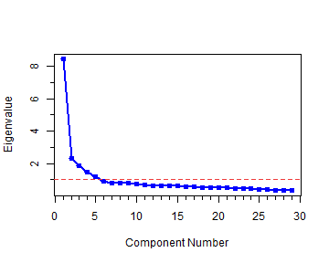
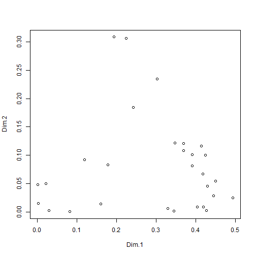
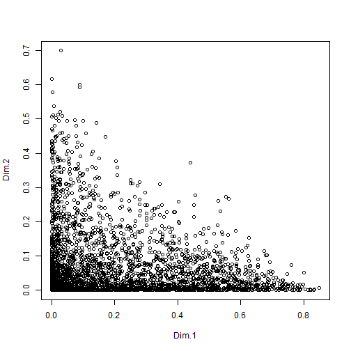

### Load the dataset
Load the whole dataset into mydatatemp. We can set the eigenvalues limit for the output table and corfactor limit for output correlation table.


```r
mydatatemp <- read.csv("../../data/boat/boats.csv", header = TRUE)
eigenvalues.limit <- 1
corfactor.limit <- 0.4
```


Extract a subset of dataset to be used in Principal component analysis for Question 1. 

```r
mydata <- mydatatemp[, 2:30]
```


--- .class #id 

### Principal Component Analysis
We used PCA function from FactoMineR package. Store the PCA results into result object as following.

```r
result <- PCA(mydata, graph = FALSE)
```


--- .class #id 

### Results

PCA results are stored in result object. Components of PCA can be accessed using following component names.


No |Name         |      Description                          
------------|-----|---------|-----------
1 | "$eig"        |     eigenvalues                        
2 | "$var"         |    results for the variables         
3 | "$var$coord"    |   coord. for the variables          
4 | "$var$cor"       |  correlations variables - dimensions
5 | "$var$cos2"      |   cos2 for the variables             
6 | "$var$contrib"    |  contributions of the variables 

--- .class #id 

### Continue

No |Name         |      Description                          
------------|-----|---------|-----------
7 | "$ind"        |      results for the individuals        
8 | "$ind$coord"   |     coord. for the individuals         
9 | "$ind$cos2"   |      cos2 for the individuals           
10 |"$ind$contrib"  |    contributions of the individuals  
11 |"$call"       |      summary statistics              
12 |"$call$centre"  |    mean of the variables            
13 |"$call$ecart.type" | standard error of the variables  
14 |"$call$row.w"    |   weights for the individuals        
15 |"$call$col.w"   |    weights for the variables

--- .class #id 

### Output and tables

#### 1. Eigen Values &amp; Percentage of Total Variance

Get the eigenvalues object. Create a table using xtable function from xtable library. However, we don't want to see all the data. We want to see only component which has eigenvalues greater than 1,

--- .class #id 


```r
eigenvalues <- result$eig

data.for.eigentable <- getdataforeigentable(eigenvalues, eigenvalues.limit)

print(xtable(head(data.for.eigentable), digits = 3), comment = FALSE, include.rownames = TRUE, 
    type = "HTML")
```

<TABLE border=1>
<TR> <TH>  </TH> <TH> eigenvalue </TH> <TH> percentage of variance </TH> <TH> cumulative percentage of variance </TH>  </TR>
  <TR> <TD align="right"> comp 1 </TD> <TD align="right"> 8.433 </TD> <TD align="right"> 29.078 </TD> <TD align="right"> 29.078 </TD> </TR>
  <TR> <TD align="right"> comp 2 </TD> <TD align="right"> 2.334 </TD> <TD align="right"> 8.047 </TD> <TD align="right"> 37.125 </TD> </TR>
  <TR> <TD align="right"> comp 3 </TD> <TD align="right"> 1.863 </TD> <TD align="right"> 6.423 </TD> <TD align="right"> 43.548 </TD> </TR>
  <TR> <TD align="right"> comp 4 </TD> <TD align="right"> 1.458 </TD> <TD align="right"> 5.026 </TD> <TD align="right"> 48.574 </TD> </TR>
  <TR> <TD align="right"> comp 5 </TD> <TD align="right"> 1.207 </TD> <TD align="right"> 4.163 </TD> <TD align="right"> 52.738 </TD> </TR>
   </TABLE>


--- .class #id 

#### 2. Scree Plot
Generate a scree plot using following command. We assign the labels for x axis and y axis manually.

```r
## start to draw the plot
plot(eigenvalues$eigenvalue, type = "o", xlab = "Component Number", ylab = "Eigenvalue", 
    col = colors()[26], lwd = 2)
## add minor ticks
minor.tick(nx = 5, ny = 2)
## add abline at y = 1
abline(h = 1, lty = 2, col = colors()[34])
```




--- .class #id 

#### 3. Correlation of old variables with new factors

Correlation matrix of each new factor with the initial variables can be accessed with $var$cor component in result object. Create a table using xtable function from xtable library. However, we don't want to see all the correlations but which has correlation coefficient greater than 0.4.

--- .class #id 


```r
corfactor <- result$var$cor

corfactor <- getcorfactortable(corfactor, corfactor.limit)

print(xtable(head(corfactor), digits = 3), comment = FALSE, include.rownames = TRUE, 
    type = "HTML")
```

<TABLE border=1>
<TR> <TH>  </TH> <TH> Dim.1 </TH> <TH> Dim.2 </TH> <TH> Dim.3 </TH> <TH> Dim.4 </TH> <TH> Dim.5 </TH>  </TR>
  <TR> <TD align="right"> Q1_1 </TD> <TD align="right">  </TD> <TD align="right">  </TD> <TD align="right">  </TD> <TD align="right">  </TD> <TD align="right">  </TD> </TR>
  <TR> <TD align="right"> Q1_2 </TD> <TD align="right">  </TD> <TD align="right">  </TD> <TD align="right"> 0.632 </TD> <TD align="right">  </TD> <TD align="right">  </TD> </TR>
  <TR> <TD align="right"> Q1_3 </TD> <TD align="right"> 0.647 </TD> <TD align="right">  </TD> <TD align="right">  </TD> <TD align="right">  </TD> <TD align="right">  </TD> </TR>
  <TR> <TD align="right"> Q1_4 </TD> <TD align="right"> 0.401 </TD> <TD align="right">  </TD> <TD align="right">  </TD> <TD align="right">  </TD> <TD align="right"> 0.458 </TD> </TR>
  <TR> <TD align="right"> Q1_5 </TD> <TD align="right"> 0.575 </TD> <TD align="right">  </TD> <TD align="right">  </TD> <TD align="right">  </TD> <TD align="right">  </TD> </TR>
  <TR> <TD align="right"> Q1_6 </TD> <TD align="right"> 0.626 </TD> <TD align="right">  </TD> <TD align="right">  </TD> <TD align="right">  </TD> <TD align="right">  </TD> </TR>
   </TABLE>


--- .class #id 

#### 4. Matrix:Respondents - Factors

New matrix(number of respondents X number of factors) can be accessed at $ind$coord component of result object. First 10 rows are ouput as an example.


```r
factormatrix <- result$ind$coord

print(xtable(head(factormatrix[1:10, ]), digits = 3), comment = FALSE, include.rownames = TRUE, 
    type = "HTML")
```

<TABLE border=1>
<TR> <TH>  </TH> <TH> Dim.1 </TH> <TH> Dim.2 </TH> <TH> Dim.3 </TH> <TH> Dim.4 </TH> <TH> Dim.5 </TH>  </TR>
  <TR> <TD align="right"> 1 </TD> <TD align="right"> 1.711 </TD> <TD align="right"> 0.664 </TD> <TD align="right"> -1.815 </TD> <TD align="right"> -0.600 </TD> <TD align="right"> 1.570 </TD> </TR>
  <TR> <TD align="right"> 2 </TD> <TD align="right"> 6.450 </TD> <TD align="right"> -0.950 </TD> <TD align="right"> -1.488 </TD> <TD align="right"> 0.666 </TD> <TD align="right"> -0.561 </TD> </TR>
  <TR> <TD align="right"> 3 </TD> <TD align="right"> 4.549 </TD> <TD align="right"> 0.601 </TD> <TD align="right"> 0.027 </TD> <TD align="right"> 1.439 </TD> <TD align="right"> -1.224 </TD> </TR>
  <TR> <TD align="right"> 4 </TD> <TD align="right"> 4.457 </TD> <TD align="right"> -0.980 </TD> <TD align="right"> -0.221 </TD> <TD align="right"> 1.816 </TD> <TD align="right"> -0.463 </TD> </TR>
  <TR> <TD align="right"> 5 </TD> <TD align="right"> 1.393 </TD> <TD align="right"> -0.975 </TD> <TD align="right"> -2.210 </TD> <TD align="right"> -0.413 </TD> <TD align="right"> -0.197 </TD> </TR>
  <TR> <TD align="right"> 6 </TD> <TD align="right"> 4.214 </TD> <TD align="right"> 1.652 </TD> <TD align="right"> -0.597 </TD> <TD align="right"> -0.682 </TD> <TD align="right"> 2.318 </TD> </TR>
   </TABLE>


--- .class #id 

#### 5. Other interesting plots


```r
plot(result$var$cos2)
```

 


```r
plot(result$ind$cos2)
```

 

