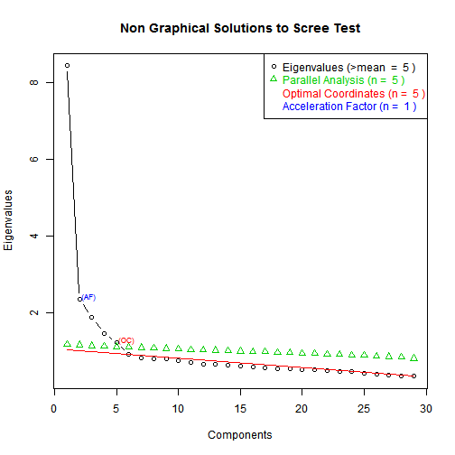

<div class="container">
<center>
<h2>TEMPLATE REPORT FOR DIMENSIONALITY REDUCTION</h2>

<h2>CASE: MARKET RESEARCH, MARKET SEGMENTATION, PURCHASE DRIVERS</h2>
</center>
<hr>

<!--Proccess Parameters:

Please first edit the parameters in the chunk below. These parameters incude the data used as well as parameters regarding how many factors/drivers to find and with which statistical methods. The data loaded in that file are used in this report.-->


<center><h3>
The Business Decision</h3></center>
<hr>

<p><u>The management team of a company is interested in understanding the **key purchase drivers of their customers** and understand its market through **market segmentation**.</u></p>  

<center><h3>The Data</h3></center>
<hr>


<p><h4>In this case the managers use data from a **market research survey** of a few thousand potential prospects and customers. In this particular case there are 2000 respondents each having answered 75 questions, as this data summary shows.</h4></p> 

<!-- html table generated in R 2.15.3 by xtable 1.7-1 package -->
<!-- Thu Dec 12 00:02:05 2013 -->
<TABLE class='table table-striped table-hover table-bordered'>
<CAPTION ALIGN="top"> Respondents - Questions </CAPTION>
<TR> <TH>  </TH> <TH> No.Respondents </TH> <TH> No.Questions </TH>  </TR>
  <TR> <TD align="right"> 1 </TD> <TD align="right"> 2813 </TD> <TD align="right">  29 </TD> </TR>
   </TABLE>


<p><b>For example the first respondent gave these answers for the first 10 Questions:</b></p>
<br>


<center>
<!-- html table generated in R 2.15.3 by xtable 1.7-1 package -->
<!-- Thu Dec 12 00:02:05 2013 -->
<TABLE class='table table-striped table-hover table-bordered'>
<CAPTION ALIGN="top"> First Respondent </CAPTION>
<TR> <TH>  </TH> <TH> Q1_1 </TH> <TH> Q1_2 </TH> <TH> Q1_3 </TH> <TH> Q1_4 </TH> <TH> Q1_5 </TH> <TH> Q1_6 </TH> <TH> Q1_7 </TH> <TH> Q1_8 </TH> <TH> Q1_9 </TH> <TH> Q1_10 </TH>  </TR>
  <TR> <TD align="right"> 1 </TD> <TD align="right">   5 </TD> <TD align="right">   2 </TD> <TD align="right">   2 </TD> <TD align="right">   5 </TD> <TD align="right">   4 </TD> <TD align="right">   3 </TD> <TD align="right">   2 </TD> <TD align="right">   2 </TD> <TD align="right">   2 </TD> <TD align="right">   5 </TD> </TR>
   </TABLE>

</center>
<br>
<p>The questions for this case are described in the file Factor_analysis_Boat_SurveyQuestions.doc.</p>

<center><h3>Purchase Drivers: The Dimensionality Reduction Process</h3></center>
<hr>

<p>The analysis is done using the 8 steps outlined in the report "DERIVED ATTRIBUTES AND DIMENSIONALITY REDUCTION METHODS". The results are as follows.</p>

<!--Summary statistics of the data-->
<center>

<!-- html table generated in R 2.15.3 by xtable 1.7-1 package -->
<!-- Thu Dec 12 00:02:05 2013 -->
<TABLE class='table table-striped table-hover table-bordered'>
<CAPTION ALIGN="top"> Summary Table of Boat Data for first 10 Questions </CAPTION>
<TR> <TH>  </TH> <TH>      Q1_1 </TH> <TH>      Q1_2 </TH> <TH>      Q1_3 </TH> <TH>      Q1_4 </TH> <TH>      Q1_5 </TH> <TH>      Q1_6 </TH> <TH>      Q1_7 </TH> <TH>      Q1_8 </TH> <TH>      Q1_9 </TH> <TH>     Q1_10 </TH>  </TR>
  <TR> <TD align="right"> 1 </TD> <TD> Min.   :1.00   </TD> <TD> Min.   :1.00   </TD> <TD> Min.   :1.00   </TD> <TD> Min.   :1.00   </TD> <TD> Min.   :1.00   </TD> <TD> Min.   :1.00   </TD> <TD> Min.   :1.00   </TD> <TD> Min.   :1.00   </TD> <TD> Min.   :1.00   </TD> <TD> Min.   :1.00   </TD> </TR>
  <TR> <TD align="right"> 2 </TD> <TD> 1st Qu.:4.00   </TD> <TD> 1st Qu.:2.00   </TD> <TD> 1st Qu.:2.00   </TD> <TD> 1st Qu.:3.00   </TD> <TD> 1st Qu.:3.00   </TD> <TD> 1st Qu.:4.00   </TD> <TD> 1st Qu.:3.00   </TD> <TD> 1st Qu.:3.00   </TD> <TD> 1st Qu.:2.00   </TD> <TD> 1st Qu.:3.00   </TD> </TR>
  <TR> <TD align="right"> 3 </TD> <TD> Median :4.00   </TD> <TD> Median :3.00   </TD> <TD> Median :3.00   </TD> <TD> Median :4.00   </TD> <TD> Median :4.00   </TD> <TD> Median :4.00   </TD> <TD> Median :4.00   </TD> <TD> Median :4.00   </TD> <TD> Median :3.00   </TD> <TD> Median :3.00   </TD> </TR>
  <TR> <TD align="right"> 4 </TD> <TD> Mean   :4.03   </TD> <TD> Mean   :2.89   </TD> <TD> Mean   :3.12   </TD> <TD> Mean   :3.89   </TD> <TD> Mean   :3.55   </TD> <TD> Mean   :3.95   </TD> <TD> Mean   :3.67   </TD> <TD> Mean   :3.74   </TD> <TD> Mean   :2.89   </TD> <TD> Mean   :3.37   </TD> </TR>
  <TR> <TD align="right"> 5 </TD> <TD> 3rd Qu.:5.00   </TD> <TD> 3rd Qu.:4.00   </TD> <TD> 3rd Qu.:4.00   </TD> <TD> 3rd Qu.:4.00   </TD> <TD> 3rd Qu.:4.00   </TD> <TD> 3rd Qu.:4.00   </TD> <TD> 3rd Qu.:4.00   </TD> <TD> 3rd Qu.:4.00   </TD> <TD> 3rd Qu.:4.00   </TD> <TD> 3rd Qu.:4.00   </TD> </TR>
  <TR> <TD align="right"> 6 </TD> <TD> Max.   :5.00   </TD> <TD> Max.   :5.00   </TD> <TD> Max.   :5.00   </TD> <TD> Max.   :5.00   </TD> <TD> Max.   :5.00   </TD> <TD> Max.   :5.00   </TD> <TD> Max.   :5.00   </TD> <TD> Max.   :5.00   </TD> <TD> Max.   :5.00   </TD> <TD> Max.   :5.00   </TD> </TR>
   </TABLE>


</center>


Let's see the correlation of only the attributes used for dimemsionality reduction. We would like to only see the pairs for which the correlation is larger than 0.5 in absolute value (the threshold can change by changing the number in the command below).
<br>
<pre>

```
## 
## Attribute Q1_1 has these correlations above 0.4 : No Large Correlations
## Attribute Q1_2 has these correlations above 0.4 : No Large Correlations
## Attribute Q1_3 has these correlations above 0.4 : Q1_7 : 0.4436 ,Q1_9 : 0.5789 ,Q1_13 : 0.4845 ,Q1_14 : 0.4615 ,Q1_26 : 0.471 ,Q1_27 : 0.4008 ,Q1_28 : 0.4253 ,
## Attribute Q1_4 has these correlations above 0.4 : No Large Correlations
## Attribute Q1_5 has these correlations above 0.4 : Q1_13 : 0.4504 ,Q1_14 : 0.4599 ,Q1_15 : 0.4176 ,
## Attribute Q1_6 has these correlations above 0.4 : Q1_7 : 0.546 ,Q1_18 : 0.4375 ,Q1_21 : 0.4242 ,Q1_22 : 0.4088 ,Q1_25 : 0.42 ,
## Attribute Q1_7 has these correlations above 0.4 : Q1_3 : 0.4436 ,Q1_6 : 0.546 ,Q1_9 : 0.4908 ,Q1_18 : 0.4009 ,Q1_25 : 0.4194 ,
## Attribute Q1_8 has these correlations above 0.4 : No Large Correlations
## Attribute Q1_9 has these correlations above 0.4 : Q1_3 : 0.5789 ,Q1_7 : 0.4908 ,Q1_13 : 0.4801 ,Q1_14 : 0.4267 ,Q1_26 : 0.5027 ,Q1_28 : 0.4025 ,
## Attribute Q1_10 has these correlations above 0.4 : No Large Correlations
## Attribute Q1_11 has these correlations above 0.4 : No Large Correlations
## Attribute Q1_12 has these correlations above 0.4 : No Large Correlations
## Attribute Q1_13 has these correlations above 0.4 : Q1_3 : 0.4845 ,Q1_5 : 0.4504 ,Q1_9 : 0.4801 ,Q1_14 : 0.6382 ,Q1_15 : 0.4577 ,Q1_16 : 0.4271 ,Q1_17 : 0.4259 ,Q1_26 : 0.481 ,Q1_28 : 0.4041 ,
## Attribute Q1_14 has these correlations above 0.4 : Q1_3 : 0.4615 ,Q1_5 : 0.4599 ,Q1_9 : 0.4267 ,Q1_13 : 0.6382 ,Q1_15 : 0.4999 ,Q1_16 : 0.4272 ,Q1_20 : 0.4065 ,Q1_26 : 0.4649 ,Q1_28 : 0.4049 ,
## Attribute Q1_15 has these correlations above 0.4 : Q1_5 : 0.4176 ,Q1_13 : 0.4577 ,Q1_14 : 0.4999 ,Q1_16 : 0.4117 ,Q1_20 : 0.407 ,Q1_25 : 0.428 ,
## Attribute Q1_16 has these correlations above 0.4 : Q1_13 : 0.4271 ,Q1_14 : 0.4272 ,Q1_15 : 0.4117 ,Q1_17 : 0.6314 ,Q1_20 : 0.5216 ,Q1_26 : 0.402 ,Q1_27 : 0.4758 ,Q1_28 : 0.4964 ,
## Attribute Q1_17 has these correlations above 0.4 : Q1_13 : 0.4259 ,Q1_16 : 0.6314 ,Q1_20 : 0.4456 ,Q1_27 : 0.4379 ,Q1_28 : 0.4625 ,
## Attribute Q1_18 has these correlations above 0.4 : Q1_6 : 0.4375 ,Q1_7 : 0.4009 ,Q1_19 : 0.4873 ,Q1_21 : 0.4728 ,Q1_22 : 0.437 ,Q1_24 : 0.4227 ,
## Attribute Q1_19 has these correlations above 0.4 : Q1_18 : 0.4873 ,Q1_21 : 0.44 ,
## Attribute Q1_20 has these correlations above 0.4 : Q1_14 : 0.4065 ,Q1_15 : 0.407 ,Q1_16 : 0.5216 ,Q1_17 : 0.4456 ,Q1_23 : 0.4045 ,Q1_25 : 0.4056 ,Q1_26 : 0.4034 ,Q1_27 : 0.5033 ,Q1_28 : 0.5203 ,
## Attribute Q1_21 has these correlations above 0.4 : Q1_6 : 0.4242 ,Q1_18 : 0.4728 ,Q1_19 : 0.44 ,Q1_22 : 0.4212 ,Q1_24 : 0.4242 ,
## Attribute Q1_22 has these correlations above 0.4 : Q1_6 : 0.4088 ,Q1_18 : 0.437 ,Q1_21 : 0.4212 ,
## Attribute Q1_23 has these correlations above 0.4 : Q1_20 : 0.4045 ,Q1_28 : 0.4386 ,
## Attribute Q1_24 has these correlations above 0.4 : Q1_18 : 0.4227 ,Q1_21 : 0.4242 ,
## Attribute Q1_25 has these correlations above 0.4 : Q1_6 : 0.42 ,Q1_7 : 0.4194 ,Q1_15 : 0.428 ,Q1_20 : 0.4056 ,Q1_28 : 0.4013 ,
## Attribute Q1_26 has these correlations above 0.4 : Q1_3 : 0.471 ,Q1_9 : 0.5027 ,Q1_13 : 0.481 ,Q1_14 : 0.4649 ,Q1_16 : 0.402 ,Q1_20 : 0.4034 ,Q1_27 : 0.4504 ,Q1_28 : 0.4729 ,
## Attribute Q1_27 has these correlations above 0.4 : Q1_3 : 0.4008 ,Q1_16 : 0.4758 ,Q1_17 : 0.4379 ,Q1_20 : 0.5033 ,Q1_26 : 0.4504 ,Q1_28 : 0.6153 ,
## Attribute Q1_28 has these correlations above 0.4 : Q1_3 : 0.4253 ,Q1_9 : 0.4025 ,Q1_13 : 0.4041 ,Q1_14 : 0.4049 ,Q1_16 : 0.4964 ,Q1_17 : 0.4625 ,Q1_20 : 0.5203 ,Q1_23 : 0.4386 ,Q1_25 : 0.4013 ,Q1_26 : 0.4729 ,Q1_27 : 0.6153 ,
```

</pre>
<hr>
<h3><center>Now let's get the factors using the selected method:</center></h3>
<br>
<h3><center>Get the eigenvalues</center></h3>

<!-- html table generated in R 2.15.3 by xtable 1.7-1 package -->
<!-- Thu Dec 12 00:02:06 2013 -->
<TABLE class='table table-striped table-hover table-bordered'>
<CAPTION ALIGN="top"> Eigenvalues Table </CAPTION>
<TR> <TH>  </TH> <TH> Eigenvalues </TH> <TH> percentage of variance </TH> <TH> cumulative percentage of variance </TH>  </TR>
  <TR> <TD align="right"> comp 1 </TD> <TD align="right"> 8.43 </TD> <TD align="right"> 29.08 </TD> <TD align="right"> 29.08 </TD> </TR>
  <TR> <TD align="right"> comp 2 </TD> <TD align="right"> 2.33 </TD> <TD align="right"> 8.05 </TD> <TD align="right"> 37.12 </TD> </TR>
  <TR> <TD align="right"> comp 3 </TD> <TD align="right"> 1.86 </TD> <TD align="right"> 6.42 </TD> <TD align="right"> 43.55 </TD> </TR>
  <TR> <TD align="right"> comp 4 </TD> <TD align="right"> 1.46 </TD> <TD align="right"> 5.03 </TD> <TD align="right"> 48.57 </TD> </TR>
  <TR> <TD align="right"> comp 5 </TD> <TD align="right"> 1.21 </TD> <TD align="right"> 4.16 </TD> <TD align="right"> 52.74 </TD> </TR>
  <TR> <TD align="right"> comp 6 </TD> <TD align="right"> 0.90 </TD> <TD align="right"> 3.10 </TD> <TD align="right"> 55.84 </TD> </TR>
  <TR> <TD align="right"> comp 7 </TD> <TD align="right"> 0.82 </TD> <TD align="right"> 2.82 </TD> <TD align="right"> 58.65 </TD> </TR>
  <TR> <TD align="right"> comp 8 </TD> <TD align="right"> 0.79 </TD> <TD align="right"> 2.71 </TD> <TD align="right"> 61.36 </TD> </TR>
  <TR> <TD align="right"> comp 9 </TD> <TD align="right"> 0.78 </TD> <TD align="right"> 2.69 </TD> <TD align="right"> 64.05 </TD> </TR>
  <TR> <TD align="right"> comp 10 </TD> <TD align="right"> 0.74 </TD> <TD align="right"> 2.56 </TD> <TD align="right"> 66.61 </TD> </TR>
  <TR> <TD align="right"> comp 11 </TD> <TD align="right"> 0.69 </TD> <TD align="right"> 2.37 </TD> <TD align="right"> 68.98 </TD> </TR>
  <TR> <TD align="right"> comp 12 </TD> <TD align="right"> 0.65 </TD> <TD align="right"> 2.25 </TD> <TD align="right"> 71.23 </TD> </TR>
  <TR> <TD align="right"> comp 13 </TD> <TD align="right"> 0.65 </TD> <TD align="right"> 2.23 </TD> <TD align="right"> 73.47 </TD> </TR>
  <TR> <TD align="right"> comp 14 </TD> <TD align="right"> 0.62 </TD> <TD align="right"> 2.13 </TD> <TD align="right"> 75.60 </TD> </TR>
  <TR> <TD align="right"> comp 15 </TD> <TD align="right"> 0.61 </TD> <TD align="right"> 2.10 </TD> <TD align="right"> 77.70 </TD> </TR>
  <TR> <TD align="right"> comp 16 </TD> <TD align="right"> 0.58 </TD> <TD align="right"> 1.99 </TD> <TD align="right"> 79.69 </TD> </TR>
  <TR> <TD align="right"> comp 17 </TD> <TD align="right"> 0.56 </TD> <TD align="right"> 1.94 </TD> <TD align="right"> 81.62 </TD> </TR>
  <TR> <TD align="right"> comp 18 </TD> <TD align="right"> 0.54 </TD> <TD align="right"> 1.85 </TD> <TD align="right"> 83.47 </TD> </TR>
  <TR> <TD align="right"> comp 19 </TD> <TD align="right"> 0.52 </TD> <TD align="right"> 1.81 </TD> <TD align="right"> 85.28 </TD> </TR>
  <TR> <TD align="right"> comp 20 </TD> <TD align="right"> 0.51 </TD> <TD align="right"> 1.76 </TD> <TD align="right"> 87.04 </TD> </TR>
  <TR> <TD align="right"> comp 21 </TD> <TD align="right"> 0.50 </TD> <TD align="right"> 1.72 </TD> <TD align="right"> 88.77 </TD> </TR>
  <TR> <TD align="right"> comp 22 </TD> <TD align="right"> 0.49 </TD> <TD align="right"> 1.69 </TD> <TD align="right"> 90.45 </TD> </TR>
  <TR> <TD align="right"> comp 23 </TD> <TD align="right"> 0.46 </TD> <TD align="right"> 1.59 </TD> <TD align="right"> 92.04 </TD> </TR>
  <TR> <TD align="right"> comp 24 </TD> <TD align="right"> 0.46 </TD> <TD align="right"> 1.57 </TD> <TD align="right"> 93.61 </TD> </TR>
  <TR> <TD align="right"> comp 25 </TD> <TD align="right"> 0.41 </TD> <TD align="right"> 1.42 </TD> <TD align="right"> 95.03 </TD> </TR>
  <TR> <TD align="right"> comp 26 </TD> <TD align="right"> 0.38 </TD> <TD align="right"> 1.32 </TD> <TD align="right"> 96.36 </TD> </TR>
  <TR> <TD align="right"> comp 27 </TD> <TD align="right"> 0.37 </TD> <TD align="right"> 1.28 </TD> <TD align="right"> 97.63 </TD> </TR>
  <TR> <TD align="right"> comp 28 </TD> <TD align="right"> 0.35 </TD> <TD align="right"> 1.22 </TD> <TD align="right"> 98.85 </TD> </TR>
  <TR> <TD align="right"> comp 29 </TD> <TD align="right"> 0.33 </TD> <TD align="right"> 1.15 </TD> <TD align="right"> 100.00 </TD> </TR>
   </TABLE>

<hr>
<h3><center>Get the Scree Plot</center></h3>

<center></center>

<hr>
<center><h4>Get the Correlation of old variables with new factors<h4></center>

<!-- html table generated in R 2.15.3 by xtable 1.7-1 package -->
<!-- Thu Dec 12 00:02:06 2013 -->
<TABLE class='table table-striped table-hover table-bordered'>
<CAPTION ALIGN="top"> Correlation of old variables with new factors </CAPTION>
<TR> <TH>  </TH> <TH> Dim.1 </TH> <TH> Dim.2 </TH> <TH> Dim.3 </TH> <TH> Dim.4 </TH> <TH> Dim.5 </TH>  </TR>
  <TR> <TD align="right"> Q1_1 </TD> <TD align="right"> 0.346 </TD> <TD align="right"> 0.304 </TD> <TD align="right"> 0.111 </TD> <TD align="right"> -0.073 </TD> <TD align="right"> 0.345 </TD> </TR>
  <TR> <TD align="right"> Q1_2 </TD> <TD align="right"> -0.038 </TD> <TD align="right"> -0.219 </TD> <TD align="right"> 0.632 </TD> <TD align="right"> 0.393 </TD> <TD align="right"> 0.006 </TD> </TR>
  <TR> <TD align="right"> Q1_3 </TD> <TD align="right"> 0.647 </TD> <TD align="right"> -0.258 </TD> <TD align="right"> -0.167 </TD> <TD align="right"> 0.203 </TD> <TD align="right"> -0.050 </TD> </TR>
  <TR> <TD align="right"> Q1_4 </TD> <TD align="right"> 0.401 </TD> <TD align="right"> 0.118 </TD> <TD align="right"> -0.324 </TD> <TD align="right"> -0.082 </TD> <TD align="right"> 0.458 </TD> </TR>
  <TR> <TD align="right"> Q1_5 </TD> <TD align="right"> 0.575 </TD> <TD align="right"> -0.078 </TD> <TD align="right"> -0.340 </TD> <TD align="right"> -0.028 </TD> <TD align="right"> 0.323 </TD> </TR>
  <TR> <TD align="right"> Q1_6 </TD> <TD align="right"> 0.626 </TD> <TD align="right"> 0.285 </TD> <TD align="right"> 0.030 </TD> <TD align="right"> 0.161 </TD> <TD align="right"> -0.190 </TD> </TR>
  <TR> <TD align="right"> Q1_7 </TD> <TD align="right"> 0.647 </TD> <TD align="right"> 0.094 </TD> <TD align="right"> -0.011 </TD> <TD align="right"> 0.264 </TD> <TD align="right"> -0.270 </TD> </TR>
  <TR> <TD align="right"> Q1_8 </TD> <TD align="right"> 0.049 </TD> <TD align="right"> 0.122 </TD> <TD align="right"> 0.557 </TD> <TD align="right"> -0.035 </TD> <TD align="right"> 0.388 </TD> </TR>
  <TR> <TD align="right"> Q1_9 </TD> <TD align="right"> 0.608 </TD> <TD align="right"> -0.329 </TD> <TD align="right"> -0.104 </TD> <TD align="right"> 0.334 </TD> <TD align="right"> -0.188 </TD> </TR>
  <TR> <TD align="right"> Q1_10 </TD> <TD align="right"> 0.173 </TD> <TD align="right"> 0.051 </TD> <TD align="right"> 0.111 </TD> <TD align="right"> 0.620 </TD> <TD align="right"> 0.414 </TD> </TR>
  <TR> <TD align="right"> Q1_11 </TD> <TD align="right"> 0.288 </TD> <TD align="right"> -0.016 </TD> <TD align="right"> 0.373 </TD> <TD align="right"> -0.507 </TD> <TD align="right"> 0.032 </TD> </TR>
  <TR> <TD align="right"> Q1_12 </TD> <TD align="right"> -0.149 </TD> <TD align="right"> -0.224 </TD> <TD align="right"> 0.669 </TD> <TD align="right"> 0.176 </TD> <TD align="right"> 0.131 </TD> </TR>
  <TR> <TD align="right"> Q1_13 </TD> <TD align="right"> 0.644 </TD> <TD align="right"> -0.340 </TD> <TD align="right"> -0.205 </TD> <TD align="right"> 0.126 </TD> <TD align="right"> 0.191 </TD> </TR>
  <TR> <TD align="right"> Q1_14 </TD> <TD align="right"> 0.671 </TD> <TD align="right"> -0.233 </TD> <TD align="right"> -0.206 </TD> <TD align="right"> 0.024 </TD> <TD align="right"> 0.202 </TD> </TR>
  <TR> <TD align="right"> Q1_15 </TD> <TD align="right"> 0.654 </TD> <TD align="right"> -0.043 </TD> <TD align="right"> -0.099 </TD> <TD align="right"> -0.121 </TD> <TD align="right"> 0.277 </TD> </TR>
  <TR> <TD align="right"> Q1_16 </TD> <TD align="right"> 0.651 </TD> <TD align="right"> -0.317 </TD> <TD align="right"> 0.108 </TD> <TD align="right"> -0.337 </TD> <TD align="right"> -0.056 </TD> </TR>
  <TR> <TD align="right"> Q1_17 </TD> <TD align="right"> 0.608 </TD> <TD align="right"> -0.347 </TD> <TD align="right"> 0.149 </TD> <TD align="right"> -0.316 </TD> <TD align="right"> -0.010 </TD> </TR>
  <TR> <TD align="right"> Q1_18 </TD> <TD align="right"> 0.551 </TD> <TD align="right"> 0.484 </TD> <TD align="right"> 0.066 </TD> <TD align="right"> 0.126 </TD> <TD align="right"> -0.090 </TD> </TR>
  <TR> <TD align="right"> Q1_19 </TD> <TD align="right"> 0.440 </TD> <TD align="right"> 0.556 </TD> <TD align="right"> 0.110 </TD> <TD align="right"> 0.008 </TD> <TD align="right"> 0.018 </TD> </TR>
  <TR> <TD align="right"> Q1_20 </TD> <TD align="right"> 0.667 </TD> <TD align="right"> -0.169 </TD> <TD align="right"> 0.180 </TD> <TD align="right"> -0.110 </TD> <TD align="right"> -0.057 </TD> </TR>
  <TR> <TD align="right"> Q1_21 </TD> <TD align="right"> 0.474 </TD> <TD align="right"> 0.553 </TD> <TD align="right"> 0.020 </TD> <TD align="right"> 0.018 </TD> <TD align="right"> -0.155 </TD> </TR>
  <TR> <TD align="right"> Q1_22 </TD> <TD align="right"> 0.590 </TD> <TD align="right"> 0.349 </TD> <TD align="right"> 0.056 </TD> <TD align="right"> -0.051 </TD> <TD align="right"> -0.099 </TD> </TR>
  <TR> <TD align="right"> Q1_23 </TD> <TD align="right"> 0.587 </TD> <TD align="right"> -0.039 </TD> <TD align="right"> 0.142 </TD> <TD align="right"> -0.117 </TD> <TD align="right"> -0.005 </TD> </TR>
  <TR> <TD align="right"> Q1_24 </TD> <TD align="right"> 0.493 </TD> <TD align="right"> 0.429 </TD> <TD align="right"> -0.066 </TD> <TD align="right"> 0.119 </TD> <TD align="right"> -0.075 </TD> </TR>
  <TR> <TD align="right"> Q1_25 </TD> <TD align="right"> 0.636 </TD> <TD align="right"> 0.094 </TD> <TD align="right"> 0.131 </TD> <TD align="right"> -0.057 </TD> <TD align="right"> -0.020 </TD> </TR>
  <TR> <TD align="right"> Q1_26 </TD> <TD align="right"> 0.626 </TD> <TD align="right"> -0.317 </TD> <TD align="right"> -0.055 </TD> <TD align="right"> 0.197 </TD> <TD align="right"> -0.082 </TD> </TR>
  <TR> <TD align="right"> Q1_27 </TD> <TD align="right"> 0.655 </TD> <TD align="right"> -0.212 </TD> <TD align="right"> 0.137 </TD> <TD align="right"> -0.021 </TD> <TD align="right"> -0.196 </TD> </TR>
  <TR> <TD align="right"> Q1_28 </TD> <TD align="right"> 0.703 </TD> <TD align="right"> -0.157 </TD> <TD align="right"> 0.136 </TD> <TD align="right"> -0.056 </TD> <TD align="right"> -0.163 </TD> </TR>
  <TR> <TD align="right"> Q1_29 </TD> <TD align="right"> 0.423 </TD> <TD align="right"> 0.289 </TD> <TD align="right"> 0.137 </TD> <TD align="right"> -0.136 </TD> <TD align="right"> 0.079 </TD> </TR>
   </TABLE>


<h3><center>Let's see the factor scores now</center></h3>

<!-- html table generated in R 2.15.3 by xtable 1.7-1 package -->
<!-- Thu Dec 12 00:02:06 2013 -->
<TABLE class='table table-striped table-hover table-bordered'>
<CAPTION ALIGN="top"> Factor Scores </CAPTION>
<TR> <TH>  </TH> <TH> Score </TH>  </TR>
  <TR> <TD align="right"> 1 </TD> <TD align="right"> 1.711 </TD> </TR>
  <TR> <TD align="right"> 2 </TD> <TD align="right"> 6.450 </TD> </TR>
  <TR> <TD align="right"> 3 </TD> <TD align="right"> 4.549 </TD> </TR>
  <TR> <TD align="right"> 4 </TD> <TD align="right"> 4.457 </TD> </TR>
  <TR> <TD align="right"> 5 </TD> <TD align="right"> 1.393 </TD> </TR>
  <TR> <TD align="right"> 6 </TD> <TD align="right"> 4.214 </TD> </TR>
  <TR> <TD align="right"> 7 </TD> <TD align="right"> 3.417 </TD> </TR>
  <TR> <TD align="right"> 8 </TD> <TD align="right"> 0.887 </TD> </TR>
  <TR> <TD align="right"> 9 </TD> <TD align="right"> 3.422 </TD> </TR>
  <TR> <TD align="right"> 10 </TD> <TD align="right"> 1.074 </TD> </TR>
   </TABLE>


</div>
