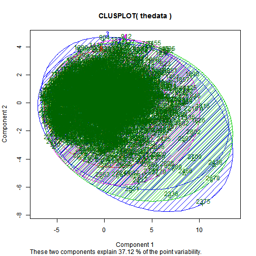
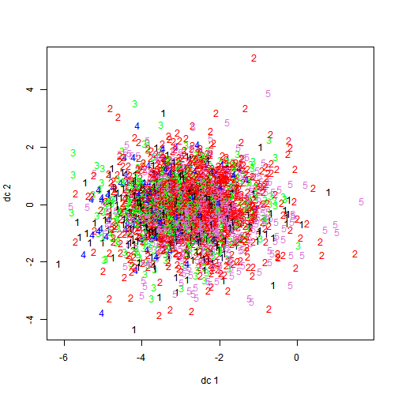

<div class="container">
<center>
<h2>TEMPLATE REPORT FOR PARTITIONING CLUSTERING WITH KMEANS</h2>

<h2>CASE: MARKET RESEARCH, MARKET SEGMENTATION, PURCHASE DRIVERS</h2>

</center>
<hr>

<!--Proccess Parameters:

Please first edit the parameters in the chunk below.-->

```{r scree,echo=FALSE,include=FALSE,results='hide'}
#include source code from factor analysis to perform cluster analysis with kmeans
source('../../code/boat/factor.R')
# create new table with new variables
colstart <- ncol(thedata) + 1
colend <- ncol(mydatatemp)
newdata <- cbind(factormatrix, mydatatemp[, colstart:colend])
# K-Means Cluster Analysis
#define no.of clusters with c variable
c<-5
fit <- kmeans(newdata, c)  # 5 cluster solution
# get cluster means
clusterlist<-aggregate(newdata, by = list(fit$cluster), FUN = mean)
#assign 50 first individuals in their clusters.
assign<-fit$cluster[1:20]
```
<hr>
<center><h6>Let's see the contribution of each component to the clusters<br>
```{r echo=FALSE,results='asis',warning=FALSE,error=FALSE,message=FALSE,resize.width=0.3}
clusterlist<-as.data.frame(clusterlist)
clusterlist<-t(clusterlist)
clusterlist<-xtable(clusterlist,caption="Cluster list Table")
print(clusterlist,type="html",html.table.attributes = "class='table table-striped table-hover table-bordered'",caption.placement="top")

```
<hr>
</h6>
</center>

<center><h6>Fitting the first 20 people in their clusters<br>

```{r echo=FALSE,results='asis',warning=FALSE,error=FALSE,message=FALSE,resize.width=0.2}
assign<-as.data.frame(assign)
colnames(assign)<-c("Member of cluster")
assign<-xtable(assign,caption="Assign individuals in their clusters")
print(assign,type="html",html.table.attributes = "class='table table-striped table-hover table-bordered',align='center'",caption.placement="top")

```
<hr>
</h6>
</center>Cluster Plot against 1st 2 principal components
```{r plots,echo=FALSE,include=FALSE,results='hide'}
#let's create some interesting plots
# Cluster Plot against 1st 2 principal components

# vary parameters for most readable graph
library(cluster)
clusplot(thedata, fit$cluster, color = TRUE, shade = TRUE, labels = 2, lines = 0)
```
<br>
<center></center>

<hr>
</h6>
</center>Centroid Plot against 1st 2 discriminant functions
```{r plots2,echo=FALSE,include=FALSE,results='hide'}
#let's create some interesting plots
library(fpc)
plotcluster(thedata, fit$cluster)
```
<br>
<center></center>

</div>