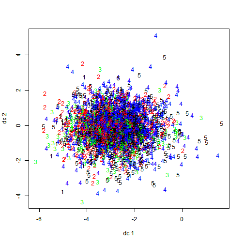

<div class="container">
<center>
<h2>TEMPLATE REPORT FOR PARTITIONING CLUSTERING WITH KMEANS</h2>

<h2>CASE: MARKET RESEARCH, MARKET SEGMENTATION, PURCHASE DRIVERS</h2>

</center>
<hr>

<!--Proccess Parameters:

Please first edit the parameters in the chunk below.-->

```{r scree,echo=FALSE,include=FALSE,results='hide'}
#include source code from factor analysis to perform cluster analysis with kmeans
source('../../code/boat/factor.R')
# create new table with new variables
colstart <- ncol(thedata) + 1
colend <- ncol(mydatatemp)
newdata <- cbind(factormatrix, mydatatemp[, colstart:colend])
# K-Means Cluster Analysis
#define no.of clusters with c variable
c<-5
#define no.of maximum iterations
iter = 10

fit <- kmeans(newdata,iter.max=iter,centers=c)  # 5 cluster solution
# get cluster means
clusterlist<-aggregate(newdata, by = list(fit$cluster), FUN = mean)
#assign 50 first individuals in their clusters.
assign<-fit$cluster[1:20]
```
<hr>
<center><h6>Let's see the contribution of each component to the clusters<br>
```{r echo=FALSE,results='asis',warning=FALSE,error=FALSE,message=FALSE,resize.width=0.3}
clusterlist<-as.data.frame(clusterlist)
clusterlist<-t(clusterlist)
colnames(clusterlist)<-c("Cluster1","Cluster2","Cluster3","Cluster4","Cluster5")
clusterlist<-xtable(clusterlist,caption="Contribution of each component to the clusters")
print(clusterlist,type="html",html.table.attributes = "class='table table-striped table-hover table-bordered'",caption.placement="top")

```
<hr>
</h6>
</center>

<center><h6>Fitting the first 20 people in their clusters<br>

```{r echo=FALSE,results='asis',warning=FALSE,error=FALSE,message=FALSE,resize.width=0.2}
assign<-as.data.frame(assign)
colnames(assign)<-c("Member of cluster")
assign<-xtable(assign,caption="Assign individuals in their clusters")
print(assign,type="html",html.table.attributes = "class='table table-striped table-hover table-bordered',align='center'",caption.placement="top")

```
<hr>
<center><h6>Size of each cluster<br>

```{r echo=FALSE,results='asis',warning=FALSE,error=FALSE,message=FALSE,resize.width=0.2}
size<-as.data.frame(fit$size)
withinss<-as.data.frame(fit$withinss)
k1<-cbind(size,withinss)
colnames(k1)<-c("Members in each cluster","Vector of within-cluster sum of squares, one component per cluster")
assign1<-xtable(k1,caption="Assign individuals in their clusters")
print(assign1,type="html",html.table.attributes = "class='table table-striped table-hover table-bordered',align='center'",caption.placement="top")

```
<hr>
</h6>
</center>
<center><h6>Table with more info about clustering<br>

```{r echo=FALSE,results='asis',warning=FALSE,error=FALSE,message=FALSE,resize.width=0.2}
totss<-as.data.frame(fit$totss)
totwithinss<-as.data.frame(fit$tot.withinss)
betweens<-as.data.frame(fit$betweens)
k2<-cbind(totss,totwithinss,betweens)
colnames(k2)<-c("The total sum of squares","Total within-cluster sum of squares","Total within-cluster sum of squares")
assign2<-xtable(k2,caption="Cluster statistics")
print(assign2,type="html",html.table.attributes = "class='table table-striped table-hover table-bordered',align='center'",caption.placement="top")

```
<hr>
</h6>
</center>
Cluster Plot against 1st 2 principal components
```{r plots,echo=FALSE,include=FALSE,results='hide'}
#let's create some interesting plots
# Cluster Plot against 1st 2 principal components

# vary parameters for most readable graph
library(cluster)
clusplot(thedata, fit$cluster, color = TRUE, shade = TRUE, labels = 2, lines = 0)
```
<br>
<center></center>

<hr>
</h6>
</center>Centroid Plot against 1st 2 discriminant functions
```{r plots2,echo=FALSE,include=FALSE,results='hide'}
#let's create some interesting plots
library(fpc)
plotcluster(thedata, fit$cluster)
```
<br>
<center></center>

</div>