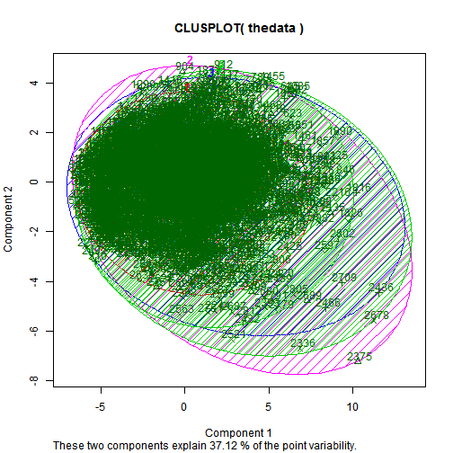

<h2>TEMPLATE REPORT FOR PARTITIONING CLUSTERING WITH KMEANS</h2>

<h2>CASE: MARKET RESEARCH, MARKET SEGMENTATION, PURCHASE DRIVERS</h2>

<!--Proccess Parameters:

Please first edit the parameters in the chunk below.-->

<h6>Let's see the contribution of each component to the clusters 
<!-- html table generated in R 2.15.3 by xtable 1.7-1 package -->
<!-- Wed Dec 11 05:14:54 2013 -->
<TABLE class='table table-striped table-hover table-bordered'>
<CAPTION ALIGN="top"> Cluster list Table </CAPTION>
<TR> <TH>  </TH> <TH> 1 </TH> <TH> 2 </TH> <TH> 3 </TH> <TH> 4 </TH> <TH> 5 </TH>  </TR>
  <TR> <TD align="right"> Group.1 </TD> <TD align="right"> 1.00 </TD> <TD align="right"> 2.00 </TD> <TD align="right"> 3.00 </TD> <TD align="right"> 4.00 </TD> <TD align="right"> 5.00 </TD> </TR>
  <TR> <TD align="right"> Dim.1 </TD> <TD align="right"> -0.18 </TD> <TD align="right"> 0.31 </TD> <TD align="right"> 0.51 </TD> <TD align="right"> -0.36 </TD> <TD align="right"> 1.00 </TD> </TR>
  <TR> <TD align="right"> Dim.2 </TD> <TD align="right"> -0.10 </TD> <TD align="right"> -0.01 </TD> <TD align="right"> 0.06 </TD> <TD align="right"> 0.12 </TD> <TD align="right"> -0.09 </TD> </TR>
  <TR> <TD align="right"> Dim.3 </TD> <TD align="right"> 0.02 </TD> <TD align="right"> 0.03 </TD> <TD align="right"> -0.06 </TD> <TD align="right"> 0.01 </TD> <TD align="right"> -0.02 </TD> </TR>
  <TR> <TD align="right"> Dim.4 </TD> <TD align="right"> 0.04 </TD> <TD align="right"> -0.07 </TD> <TD align="right"> -0.18 </TD> <TD align="right"> 0.14 </TD> <TD align="right"> -0.38 </TD> </TR>
  <TR> <TD align="right"> Dim.5 </TD> <TD align="right"> -0.01 </TD> <TD align="right"> 0.01 </TD> <TD align="right"> 0.07 </TD> <TD align="right"> -0.04 </TD> <TD align="right"> 0.08 </TD> </TR>
  <TR> <TD align="right"> Q1_29 </TD> <TD align="right"> 3.99 </TD> <TD align="right"> 4.16 </TD> <TD align="right"> 4.06 </TD> <TD align="right"> 3.99 </TD> <TD align="right"> 4.14 </TD> </TR>
  <TR> <TD align="right"> Q2 </TD> <TD align="right"> 0.92 </TD> <TD align="right"> 0.87 </TD> <TD align="right"> 0.91 </TD> <TD align="right"> 0.87 </TD> <TD align="right"> 1.00 </TD> </TR>
  <TR> <TD align="right"> Q2_Cluster </TD> <TD align="right"> 0.76 </TD> <TD align="right"> 0.72 </TD> <TD align="right"> 0.76 </TD> <TD align="right"> 0.71 </TD> <TD align="right"> 0.78 </TD> </TR>
  <TR> <TD align="right"> Q3 </TD> <TD align="right"> 4.17 </TD> <TD align="right"> 4.20 </TD> <TD align="right"> 4.24 </TD> <TD align="right"> 4.03 </TD> <TD align="right"> 4.24 </TD> </TR>
  <TR> <TD align="right"> Q4 </TD> <TD align="right"> 3.94 </TD> <TD align="right"> 4.15 </TD> <TD align="right"> 4.00 </TD> <TD align="right"> 3.62 </TD> <TD align="right"> 4.68 </TD> </TR>
  <TR> <TD align="right"> Q5 </TD> <TD align="right"> 3.21 </TD> <TD align="right"> 3.39 </TD> <TD align="right"> 3.37 </TD> <TD align="right"> 3.12 </TD> <TD align="right"> 3.59 </TD> </TR>
  <TR> <TD align="right"> Q6 </TD> <TD align="right"> 22.34 </TD> <TD align="right"> 24.77 </TD> <TD align="right"> 23.53 </TD> <TD align="right"> 21.84 </TD> <TD align="right"> 25.66 </TD> </TR>
  <TR> <TD align="right"> Q7_1 </TD> <TD align="right"> 2.20 </TD> <TD align="right"> 2.37 </TD> <TD align="right"> 2.34 </TD> <TD align="right"> 2.12 </TD> <TD align="right"> 2.43 </TD> </TR>
  <TR> <TD align="right"> Q7_2 </TD> <TD align="right"> 4.00 </TD> <TD align="right"> 4.00 </TD> <TD align="right"> 4.07 </TD> <TD align="right"> 3.94 </TD> <TD align="right"> 4.25 </TD> </TR>
  <TR> <TD align="right"> Q7_3 </TD> <TD align="right"> 3.78 </TD> <TD align="right"> 3.79 </TD> <TD align="right"> 3.87 </TD> <TD align="right"> 3.76 </TD> <TD align="right"> 4.01 </TD> </TR>
  <TR> <TD align="right"> Q7_4 </TD> <TD align="right"> 3.66 </TD> <TD align="right"> 3.72 </TD> <TD align="right"> 3.78 </TD> <TD align="right"> 3.57 </TD> <TD align="right"> 3.90 </TD> </TR>
  <TR> <TD align="right"> Q8 </TD> <TD align="right"> 2.24 </TD> <TD align="right"> 2.47 </TD> <TD align="right"> 2.52 </TD> <TD align="right"> 2.15 </TD> <TD align="right"> 2.66 </TD> </TR>
  <TR> <TD align="right"> Q9_1 </TD> <TD align="right"> 3.56 </TD> <TD align="right"> 3.76 </TD> <TD align="right"> 3.64 </TD> <TD align="right"> 3.44 </TD> <TD align="right"> 3.85 </TD> </TR>
  <TR> <TD align="right"> Q9_2 </TD> <TD align="right"> 3.40 </TD> <TD align="right"> 3.46 </TD> <TD align="right"> 3.45 </TD> <TD align="right"> 3.33 </TD> <TD align="right"> 3.69 </TD> </TR>
  <TR> <TD align="right"> Q9_3 </TD> <TD align="right"> 3.67 </TD> <TD align="right"> 3.85 </TD> <TD align="right"> 3.75 </TD> <TD align="right"> 3.66 </TD> <TD align="right"> 4.02 </TD> </TR>
  <TR> <TD align="right"> Q9_4 </TD> <TD align="right"> 3.20 </TD> <TD align="right"> 3.21 </TD> <TD align="right"> 3.30 </TD> <TD align="right"> 3.08 </TD> <TD align="right"> 3.30 </TD> </TR>
  <TR> <TD align="right"> Q9_5 </TD> <TD align="right"> 3.52 </TD> <TD align="right"> 3.53 </TD> <TD align="right"> 3.55 </TD> <TD align="right"> 3.42 </TD> <TD align="right"> 3.76 </TD> </TR>
  <TR> <TD align="right"> Q10 </TD> <TD align="right"> 22.46 </TD> <TD align="right"> 105.82 </TD> <TD align="right"> 56.45 </TD> <TD align="right"> 26.64 </TD> <TD align="right"> 221.33 </TD> </TR>
  <TR> <TD align="right"> Q11 </TD> <TD align="right"> 1.43 </TD> <TD align="right"> 1.45 </TD> <TD align="right"> 1.45 </TD> <TD align="right"> 1.47 </TD> <TD align="right"> 1.47 </TD> </TR>
  <TR> <TD align="right"> Q12 </TD> <TD align="right"> 13.64 </TD> <TD align="right"> 13.25 </TD> <TD align="right"> 13.53 </TD> <TD align="right"> 13.10 </TD> <TD align="right"> 13.30 </TD> </TR>
  <TR> <TD align="right"> Q13 </TD> <TD align="right"> 2.04 </TD> <TD align="right"> 2.04 </TD> <TD align="right"> 2.05 </TD> <TD align="right"> 2.18 </TD> <TD align="right"> 2.14 </TD> </TR>
  <TR> <TD align="right"> Q14 </TD> <TD align="right"> 2.14 </TD> <TD align="right"> 2.44 </TD> <TD align="right"> 2.21 </TD> <TD align="right"> 2.37 </TD> <TD align="right"> 2.80 </TD> </TR>
  <TR> <TD align="right"> Q15Age_cluster </TD> <TD align="right"> 2.47 </TD> <TD align="right"> 2.71 </TD> <TD align="right"> 2.65 </TD> <TD align="right"> 2.47 </TD> <TD align="right"> 2.83 </TD> </TR>
  <TR> <TD align="right"> Brandrated_Q16 </TD> <TD align="right"> 11.63 </TD> <TD align="right"> 25.13 </TD> <TD align="right"> 18.76 </TD> <TD align="right"> 49.46 </TD> <TD align="right"> 20.53 </TD> </TR>
  <TR> <TD align="right"> Q16_1 </TD> <TD align="right"> 3.61 </TD> <TD align="right"> 3.73 </TD> <TD align="right"> 3.75 </TD> <TD align="right"> 3.62 </TD> <TD align="right"> 3.79 </TD> </TR>
  <TR> <TD align="right"> Q16_2 </TD> <TD align="right"> 3.51 </TD> <TD align="right"> 3.64 </TD> <TD align="right"> 3.66 </TD> <TD align="right"> 3.50 </TD> <TD align="right"> 3.74 </TD> </TR>
  <TR> <TD align="right"> Q16_3 </TD> <TD align="right"> 3.64 </TD> <TD align="right"> 3.81 </TD> <TD align="right"> 3.79 </TD> <TD align="right"> 3.72 </TD> <TD align="right"> 3.84 </TD> </TR>
  <TR> <TD align="right"> Q16_4 </TD> <TD align="right"> 3.69 </TD> <TD align="right"> 3.81 </TD> <TD align="right"> 3.85 </TD> <TD align="right"> 3.75 </TD> <TD align="right"> 3.92 </TD> </TR>
  <TR> <TD align="right"> Q16_5 </TD> <TD align="right"> 3.67 </TD> <TD align="right"> 3.75 </TD> <TD align="right"> 3.78 </TD> <TD align="right"> 3.67 </TD> <TD align="right"> 3.85 </TD> </TR>
  <TR> <TD align="right"> Q16_6 </TD> <TD align="right"> 3.75 </TD> <TD align="right"> 3.88 </TD> <TD align="right"> 3.92 </TD> <TD align="right"> 3.81 </TD> <TD align="right"> 4.00 </TD> </TR>
  <TR> <TD align="right"> Q16_7 </TD> <TD align="right"> 3.83 </TD> <TD align="right"> 3.96 </TD> <TD align="right"> 4.02 </TD> <TD align="right"> 3.90 </TD> <TD align="right"> 4.07 </TD> </TR>
  <TR> <TD align="right"> Q16_8 </TD> <TD align="right"> 3.91 </TD> <TD align="right"> 3.91 </TD> <TD align="right"> 3.98 </TD> <TD align="right"> 3.84 </TD> <TD align="right"> 4.03 </TD> </TR>
  <TR> <TD align="right"> Q16_9 </TD> <TD align="right"> 3.86 </TD> <TD align="right"> 3.94 </TD> <TD align="right"> 3.97 </TD> <TD align="right"> 3.93 </TD> <TD align="right"> 3.93 </TD> </TR>
  <TR> <TD align="right"> Q16_10 </TD> <TD align="right"> 3.80 </TD> <TD align="right"> 3.92 </TD> <TD align="right"> 3.89 </TD> <TD align="right"> 3.77 </TD> <TD align="right"> 4.01 </TD> </TR>
  <TR> <TD align="right"> Q16_11 </TD> <TD align="right"> 3.60 </TD> <TD align="right"> 3.68 </TD> <TD align="right"> 3.72 </TD> <TD align="right"> 3.63 </TD> <TD align="right"> 3.92 </TD> </TR>
  <TR> <TD align="right"> Q16_12 </TD> <TD align="right"> 3.52 </TD> <TD align="right"> 3.64 </TD> <TD align="right"> 3.56 </TD> <TD align="right"> 3.56 </TD> <TD align="right"> 3.74 </TD> </TR>
  <TR> <TD align="right"> Q16_13 </TD> <TD align="right"> 3.63 </TD> <TD align="right"> 3.69 </TD> <TD align="right"> 3.69 </TD> <TD align="right"> 3.67 </TD> <TD align="right"> 3.87 </TD> </TR>
  <TR> <TD align="right"> Q16_14 </TD> <TD align="right"> 3.68 </TD> <TD align="right"> 3.81 </TD> <TD align="right"> 3.84 </TD> <TD align="right"> 3.74 </TD> <TD align="right"> 3.98 </TD> </TR>
  <TR> <TD align="right"> Q16_15 </TD> <TD align="right"> 3.84 </TD> <TD align="right"> 3.94 </TD> <TD align="right"> 3.96 </TD> <TD align="right"> 3.84 </TD> <TD align="right"> 4.03 </TD> </TR>
  <TR> <TD align="right"> Q16_16 </TD> <TD align="right"> 3.64 </TD> <TD align="right"> 3.78 </TD> <TD align="right"> 3.71 </TD> <TD align="right"> 3.60 </TD> <TD align="right"> 3.94 </TD> </TR>
  <TR> <TD align="right"> Q16_17 </TD> <TD align="right"> 3.77 </TD> <TD align="right"> 3.96 </TD> <TD align="right"> 3.94 </TD> <TD align="right"> 3.85 </TD> <TD align="right"> 3.93 </TD> </TR>
  <TR> <TD align="right"> Q16_18 </TD> <TD align="right"> 3.84 </TD> <TD align="right"> 3.95 </TD> <TD align="right"> 3.95 </TD> <TD align="right"> 3.83 </TD> <TD align="right"> 4.16 </TD> </TR>
  <TR> <TD align="right"> Q16_19 </TD> <TD align="right"> 3.82 </TD> <TD align="right"> 3.98 </TD> <TD align="right"> 3.98 </TD> <TD align="right"> 3.85 </TD> <TD align="right"> 4.13 </TD> </TR>
  <TR> <TD align="right"> Q16_20 </TD> <TD align="right"> 3.91 </TD> <TD align="right"> 4.03 </TD> <TD align="right"> 4.08 </TD> <TD align="right"> 3.94 </TD> <TD align="right"> 4.18 </TD> </TR>
  <TR> <TD align="right"> Q16_21 </TD> <TD align="right"> 3.90 </TD> <TD align="right"> 3.92 </TD> <TD align="right"> 3.96 </TD> <TD align="right"> 3.90 </TD> <TD align="right"> 3.89 </TD> </TR>
  <TR> <TD align="right"> Q16_22 </TD> <TD align="right"> 3.88 </TD> <TD align="right"> 3.95 </TD> <TD align="right"> 4.00 </TD> <TD align="right"> 3.93 </TD> <TD align="right"> 4.01 </TD> </TR>
  <TR> <TD align="right"> Q16_23 </TD> <TD align="right"> 3.95 </TD> <TD align="right"> 4.03 </TD> <TD align="right"> 4.03 </TD> <TD align="right"> 3.99 </TD> <TD align="right"> 4.09 </TD> </TR>
  <TR> <TD align="right"> Q16_24 </TD> <TD align="right"> 3.35 </TD> <TD align="right"> 3.33 </TD> <TD align="right"> 3.29 </TD> <TD align="right"> 3.25 </TD> <TD align="right"> 3.37 </TD> </TR>
  <TR> <TD align="right"> Q16_25 </TD> <TD align="right"> 3.59 </TD> <TD align="right"> 3.72 </TD> <TD align="right"> 3.71 </TD> <TD align="right"> 3.62 </TD> <TD align="right"> 3.86 </TD> </TR>
  <TR> <TD align="right"> Q16_26 </TD> <TD align="right"> 3.85 </TD> <TD align="right"> 3.96 </TD> <TD align="right"> 3.95 </TD> <TD align="right"> 3.87 </TD> <TD align="right"> 4.05 </TD> </TR>
  <TR> <TD align="right"> Q16_27 </TD> <TD align="right"> 3.59 </TD> <TD align="right"> 3.71 </TD> <TD align="right"> 3.65 </TD> <TD align="right"> 3.62 </TD> <TD align="right"> 3.69 </TD> </TR>
  <TR> <TD align="right"> Q17 </TD> <TD align="right"> 0.30 </TD> <TD align="right"> 0.37 </TD> <TD align="right"> 0.38 </TD> <TD align="right"> 0.33 </TD> <TD align="right"> 0.43 </TD> </TR>
  <TR> <TD align="right"> Q18 </TD> <TD align="right"> 0.47 </TD> <TD align="right"> 0.51 </TD> <TD align="right"> 0.47 </TD> <TD align="right"> 0.57 </TD> <TD align="right"> 0.47 </TD> </TR>
  <TR> <TD align="right"> FAC1_1 </TD> <TD align="right"> -0.02 </TD> <TD align="right"> 0.13 </TD> <TD align="right"> 0.12 </TD> <TD align="right"> -0.16 </TD> <TD align="right"> 0.47 </TD> </TR>
  <TR> <TD align="right"> FAC2_1 </TD> <TD align="right"> -0.03 </TD> <TD align="right"> 0.06 </TD> <TD align="right"> 0.09 </TD> <TD align="right"> -0.07 </TD> <TD align="right"> 0.14 </TD> </TR>
  <TR> <TD align="right"> FAC3_1 </TD> <TD align="right"> -0.08 </TD> <TD align="right"> 0.01 </TD> <TD align="right"> 0.09 </TD> <TD align="right"> 0.07 </TD> <TD align="right"> -0.03 </TD> </TR>
  <TR> <TD align="right"> FAC4_1 </TD> <TD align="right"> 0.00 </TD> <TD align="right"> -0.03 </TD> <TD align="right"> -0.01 </TD> <TD align="right"> 0.03 </TD> <TD align="right"> -0.13 </TD> </TR>
  <TR> <TD align="right"> FAC5_1 </TD> <TD align="right"> 0.04 </TD> <TD align="right"> -0.00 </TD> <TD align="right"> -0.15 </TD> <TD align="right"> 0.07 </TD> <TD align="right"> -0.17 </TD> </TR>
  <TR> <TD align="right"> FAC6_1 </TD> <TD align="right"> 0.01 </TD> <TD align="right"> -0.04 </TD> <TD align="right"> 0.07 </TD> <TD align="right"> -0.06 </TD> <TD align="right"> 0.04 </TD> </TR>
  <TR> <TD align="right"> FAC7_1 </TD> <TD align="right"> -0.00 </TD> <TD align="right"> -0.02 </TD> <TD align="right"> 0.05 </TD> <TD align="right"> -0.04 </TD> <TD align="right"> 0.12 </TD> </TR>
  <TR> <TD align="right"> FAC8_1 </TD> <TD align="right"> -0.01 </TD> <TD align="right"> 0.00 </TD> <TD align="right"> 0.06 </TD> <TD align="right"> -0.06 </TD> <TD align="right"> 0.13 </TD> </TR>
  <TR> <TD align="right"> FAC9_1 </TD> <TD align="right"> 0.03 </TD> <TD align="right"> -0.04 </TD> <TD align="right"> -0.03 </TD> <TD align="right"> 0.02 </TD> <TD align="right"> -0.15 </TD> </TR>
  <TR> <TD align="right"> FAC10_1 </TD> <TD align="right"> -0.07 </TD> <TD align="right"> 0.09 </TD> <TD align="right"> 0.10 </TD> <TD align="right"> -0.04 </TD> <TD align="right"> 0.24 </TD> </TR>
  <TR> <TD align="right"> FAC11_1 </TD> <TD align="right"> -0.02 </TD> <TD align="right"> 0.13 </TD> <TD align="right"> -0.01 </TD> <TD align="right"> -0.02 </TD> <TD align="right"> 0.05 </TD> </TR>
  <TR> <TD align="right"> FAC12_1 </TD> <TD align="right"> 0.04 </TD> <TD align="right"> -0.00 </TD> <TD align="right"> -0.04 </TD> <TD align="right"> -0.05 </TD> <TD align="right"> 0.18 </TD> </TR>
  <TR> <TD align="right"> FAC13_1 </TD> <TD align="right"> 0.00 </TD> <TD align="right"> -0.01 </TD> <TD align="right"> 0.02 </TD> <TD align="right"> -0.00 </TD> <TD align="right"> -0.08 </TD> </TR>
   </TABLE>

</h6>

<h6>Fitting the first 20 people in their clusters 

<!-- html table generated in R 2.15.3 by xtable 1.7-1 package -->
<!-- Wed Dec 11 05:14:54 2013 -->
<TABLE class='table table-striped table-hover table-bordered',align='center'>
<CAPTION ALIGN="top"> Assign individuals in their clusters </CAPTION>
<TR> <TH>  </TH> <TH> Member of cluster </TH>  </TR>
  <TR> <TD align="right"> 1 </TD> <TD align="right">   3 </TD> </TR>
  <TR> <TD align="right"> 2 </TD> <TD align="right">   3 </TD> </TR>
  <TR> <TD align="right"> 3 </TD> <TD align="right">   4 </TD> </TR>
  <TR> <TD align="right"> 4 </TD> <TD align="right">   2 </TD> </TR>
  <TR> <TD align="right"> 5 </TD> <TD align="right">   4 </TD> </TR>
  <TR> <TD align="right"> 6 </TD> <TD align="right">   4 </TD> </TR>
  <TR> <TD align="right"> 7 </TD> <TD align="right">   1 </TD> </TR>
  <TR> <TD align="right"> 8 </TD> <TD align="right">   2 </TD> </TR>
  <TR> <TD align="right"> 9 </TD> <TD align="right">   4 </TD> </TR>
  <TR> <TD align="right"> 10 </TD> <TD align="right">   3 </TD> </TR>
  <TR> <TD align="right"> 11 </TD> <TD align="right">   5 </TD> </TR>
  <TR> <TD align="right"> 12 </TD> <TD align="right">   1 </TD> </TR>
  <TR> <TD align="right"> 13 </TD> <TD align="right">   1 </TD> </TR>
  <TR> <TD align="right"> 14 </TD> <TD align="right">   1 </TD> </TR>
  <TR> <TD align="right"> 15 </TD> <TD align="right">   2 </TD> </TR>
  <TR> <TD align="right"> 16 </TD> <TD align="right">   1 </TD> </TR>
  <TR> <TD align="right"> 17 </TD> <TD align="right">   2 </TD> </TR>
  <TR> <TD align="right"> 18 </TD> <TD align="right">   5 </TD> </TR>
  <TR> <TD align="right"> 19 </TD> <TD align="right">   4 </TD> </TR>
  <TR> <TD align="right"> 20 </TD> <TD align="right">   2 </TD> </TR>
   </TABLE>

</h6>

Cluster Plot against 1st 2 principal components

 

</h6>

Centroid Plot against 1st 2 discriminant functions

 

